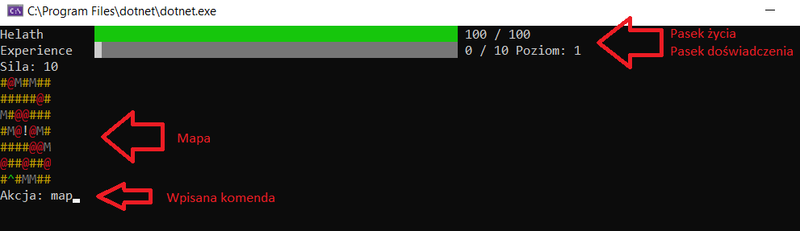

# AxeOfExile

## Opis
Konsolowa gra RPG. Graj. Przemierzaj różne krainy. Walcz z potworami. Zdobywaj doświadzczenie. Zakładaj nowe przedmioty, tylko nie daj sie zabić...

## Jak zagrac?
Po uruchomieniu "Stwórz nową grę" podaj nazwę gracza i rozpocznij przygodę.

## Główne okno
W głównym oknie gry znajdują się paski życia oraz doświadczenia gracza i jego siła. Poniżej jest mini mapa, na której widać pobliskie potwory i miejsce do wpisywania komend.

## Sterowanie
Sterowanie odbywa się za pomocą wpisywania odpowiednich komend i potwierdzeniu ich klawiszem "Enter".

w - *Przesuniecie gracza o jedna pozycje na polnoc*  
s - *Przesuniecie gracza o jedna pozycje na poludnie*  
a - *Przesuniecie gracza o jedna pozycje na zachod*  
d - *Przesuniecie gracza o jedna pozycje na wschod*  
enter - *Wejdz do miasta*  
equipment - *Zarzadzaj ekwipunkiem*  
fight - *Walka z przeciwnikiem*  
help - *Wyswietlenie pomocy*  
map - *Wyswietlenie wiekszej wersji mapy*  
menu - *Powrot do glownego menu*  

## Jak walczyć?
Aby walczyć należy ustawić się w polu na którym znajduje się przeciwnik **@**, a następnie wybrać komendę **fight**. Za wygraną walkę dostajemy doświadczenie, monety oraz czasami możemy zdobyć przedmiot. Jeżeli przegramy to giniemi. Zostajemy przeniesieni do miasta oraz tracimy trochę punktów doświadczenia.

## Życie
Życie gracza regeneruje się w tempie 60 sekund.

## Handel
Kupować oraz sprzedawać przedmioty możemu u handlarza, który znajduje się w mieście.

